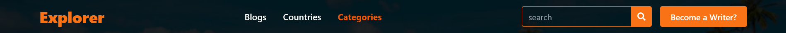
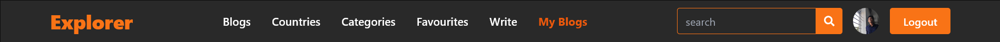
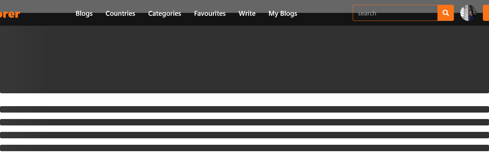
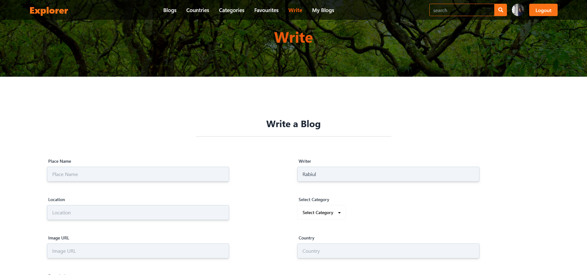

# **Explorer- Explore Travel Blogs & Find Your Next Destination**

- <a href="https://explorer-bd.netlify.app/" target="_blank">Live Site Link</a>
- <a href="https://github.com/rabiulahsan/blog-app-server" target="_blank">API Repository Link</a>

## **Table of Contents**

1. [Overview](#overview)
2. [Objectives](#objectives)
3. [Technology Used](#technology-used)
4. [Features](#features)
   - [Navbar](#navbar)
   - [Animations](#animations)
   - [Search and Favorites](#search-and-favorites)
   - [Writer's Corner](#writers-corner)
   - [Authentication](#authentication)
5. [Blog Page](#blog-page)
6. [Contact Information](#contact-information)

---

## **Overview**

**Explorer** is a blog application designed for travel enthusiasts. It provides a platform to explore travel blogs, save favorite destinations, and contribute your own posts as a writer. Featuring smooth animations and an engaging interface, **Explorer** offers an enjoyable experience for users searching for their next travel adventure.

### Key Features:

- **Beautiful Banner**:  
  A dynamic, interactive banner created with **react-slick** that updates on user clicks.  

- **Search Functionality**:  
  Quickly find tourist destinations by category, country, or keyword.  

- **Advanced Animations**:  
  Built with **framer-motion** and **react-skeleton-loading** to enhance the UI.  

- **Writer-Friendly**:  
  Users can join as writers to share their travel experiences and tips.

- **Favorites**:  
  Save blogs to revisit later.

This project showcases modern web development practices, engaging user interfaces, and seamless user experiences.

---

## **Objectives**

- **Purpose**:  
  Explorer was built to provide travel enthusiasts with a centralized platform to discover, save, and share travel destinations.  

- **Why It’s Good**:  
  - Encourages exploration and adventure by showcasing diverse destinations.  
  - Provides a user-friendly and visually appealing platform.  
  - Combines creativity with technical expertise to deliver a seamless experience.  

- **Developer Challenge**:  
  Developing Explorer was an opportunity to integrate animations, advanced UI features, and backend functionalities, creating a well-rounded full-stack project.

---

## **Technology Used**

- **Frontend**: React, Tailwind CSS, React Router, Framer Motion, React Icons, React Slick  
- **Backend**: Node.js, Express.js, MongoDB  
- **Authentication**: Firebase, JWT  
- **UI Enhancements**: React Skeleton Loading  

---

## **Features**

### **Navbar**

The navbar provides easy navigation and adapts based on user login status:

- **Without Login**:  
    
  - Browse all available blogs.  
  - Search for destinations.  
  - Option to log in or sign up.  

- **After Login**:  
    
  - Access personal and favorite blogs.  
  - Create and manage posts.   
  - Option to log out.  

---

### **Animations**

- Smooth page transitions and animations powered by **framer-motion**.  
- Skeleton loading for enhanced visual feedback during data fetching:  
    

---

### **Search and Favorites**

- Advanced search to find destinations by category or country.  
- Ability to save blogs as favorites for later reference.  

---

### **Writer's Corner**

- Users can sign up as writers to contribute blogs.  
- Intuitive editor for creating, editing, and publishing posts:  
    

---

### **Authentication**

- Secure user authentication using Firebase and JWT.  
- Role-based access for writers and readers.  

---

## **Blog Page**

The about section of a specific blog provides detailed information about the selected destination or post.  
 
- Displays the full blog content, including images and descriptions.  
- Allows users to add the blog to their **favorites** for easy access later.  
- Highlights **trending destinations** at the bottom to keep users engaged and inspire future travel plans.  

 

## **Contact Information**

For queries or collaboration, reach out at:  
**Email**: [ra.rabiulahsan@gmail.com](mailto:ra.rabiulahsan@gmail.com)  
<a href="https://www.linkedin.com/in/rabiul-ahsan" target="_blank">Linkedin</a>  
<a href="https://rabiulahsan.netlify.app/" target="_blank">Portfolio</a>
